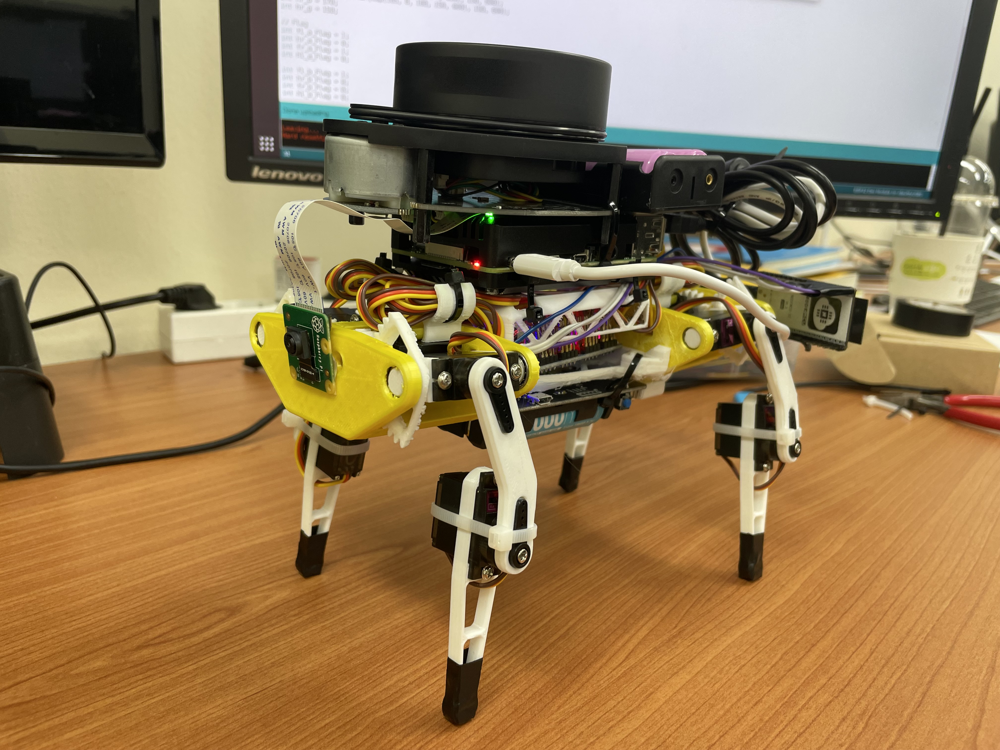
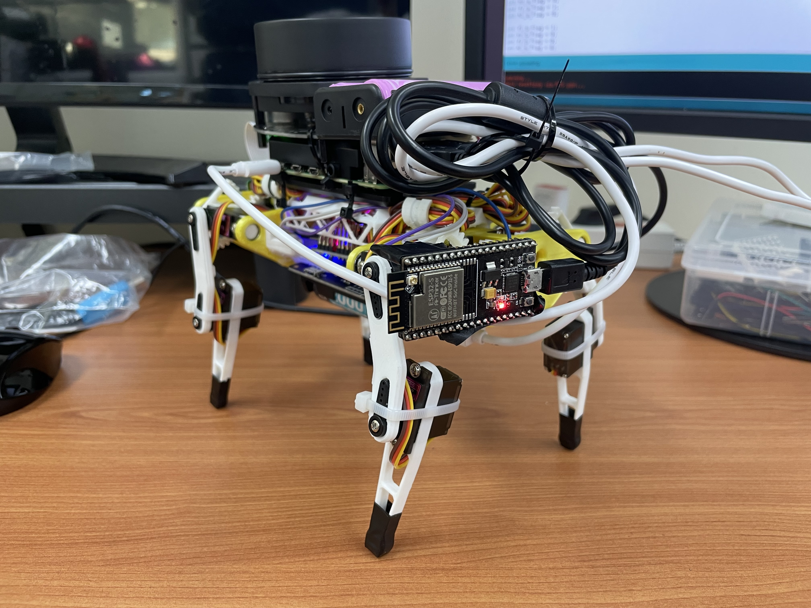

# AutoDog - 4족보행 자율주행 로봇

AutoDog은 C++과 아두이노를 기반으로 개발된 4족 보행 자율주행 로봇 프로젝트입니다. 이 프로젝트의 목표는 LiDAR 센서와 카메라를 활용한 Visual Odometry를 통해 주변 환경을 인식하고, 장애물을 회피하며 목표 지점까지 자율적으로 이동하는 로봇 시스템을 구축하는 것이었습니다. 졸업 요건이었던 캡스톤디자인 과제로 진행되었습니다.

<table>
  <tr>
    <td style="text-align: center;">AutoDog Front View</td>
    <td style="text-align: center;">AutoDog Back View</td>
  </tr>
  <tr>
    <td></td>
    <td></td>
  </tr>
</table>

## 주요 기능

- **4족 보행 제어**: 아두이노 기반 서보모터 제어를 통한 로봇의 기본 이동 (전진, 좌/우회전, 자세제어).
- **LiDAR 장애물 감지**: RPLIDAR를 이용한 360° 환경 스캔 및 실시간 장애물 회피.
- **Visual Odometry 위치 추정**: 카메라 영상을 분석 (Optical Flow, Essential Matrix)하여 로봇의 현재 위치 및 경로 추적.
- **A* 경로 계획**: 사용자가 GUI를 통해 지정한 목적지까지 최적 경로 탐색 및 이동.
- **GUI 및 시각화**: OpenCV를 활용한 카메라 영상, LiDAR 데이터, 로봇 궤적 및 지도 시각화.
- **듀얼 모드 지원**: 실제 하드웨어를 사용하는 'Real Mode' 및 데이터셋 기반 'Simulation Mode' 작동.
- **통합 제어 시스템**: C++ 기반 중앙 제어 시스템에서 센서 데이터 통합, 판단, 로봇 제어 명령 하달.

## 기술 스택

- **Core Logic & Control**: C++, Arduino (C/C++)
- **Sensors & Perception**: OpenCV, RPLIDAR SDK
- **Hardware**: Arduino Mega, Servo Motors, RPLIDAR A1, Web Camera
- **Build & Environment**: CMake, Linux (Ubuntu)
- **Libraries**: Standard C++ Libraries

## 프로젝트 아키텍처

- **임베디드 시스템 (Arduino `DogControl.ino`)**:
    - 4족 보행을 위한 다리 서보모터들의 저수준 제어를 전담합니다.
    - C++ 기반 메인 제어 시스템으로부터 시리얼 통신으로 제어 명령을 수신합니다.

- **메인 제어 시스템 (C++ `CentralSystem.cpp`, Host PC/SBC)**:
    - Linux 환경(예: PC, Raspberry Pi)에서 실행됩니다.
    - LiDAR 센서 데이터와 카메라 Visual Odometry 결과를 통합하여 주변 환경을 인식합니다.
    - 장애물 회피, A* 경로 계획 등 자율 주행을 위한 의사결정을 수행합니다.
    - Visual Odometry, LiDAR 데이터 처리, Arduino 통신 등 주요 기능들은 멀티스레딩으로 구현되어 병렬적으로 작동합니다.
    - 최종적인 이동 명령을 Arduino로 전달합니다.

- **데이터 흐름**:
    - **입력**: LiDAR (거리 데이터), 카메라 (이미지 프레임)
    - **처리**:
        - 카메라 이미지는 Visual Odometry 모듈에서 로봇의 위치 변화량으로 변환됩니다.
        - LiDAR 데이터는 장애물 정보로 가공됩니다.
        - `CentralSystem`에서 이 정보들을 종합하여 로봇의 다음 행동을 결정합니다.
    - **출력**: 결정된 행동은 Arduino로 전달되어 실제 로봇의 움직임으로 나타납니다.

## 시연

**Live URL**: [https://www.youtube.com/watch?v=saTzeXXPWuo](https://www.youtube.com/watch?v=saTzeXXPWuo)
